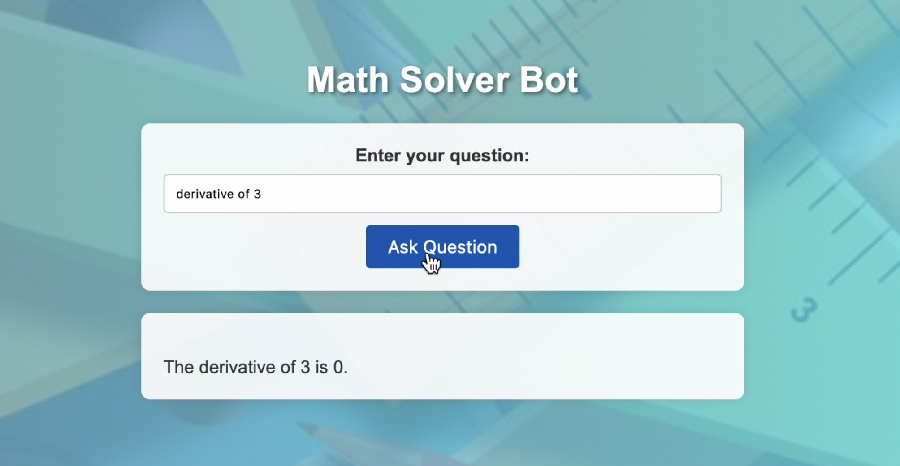
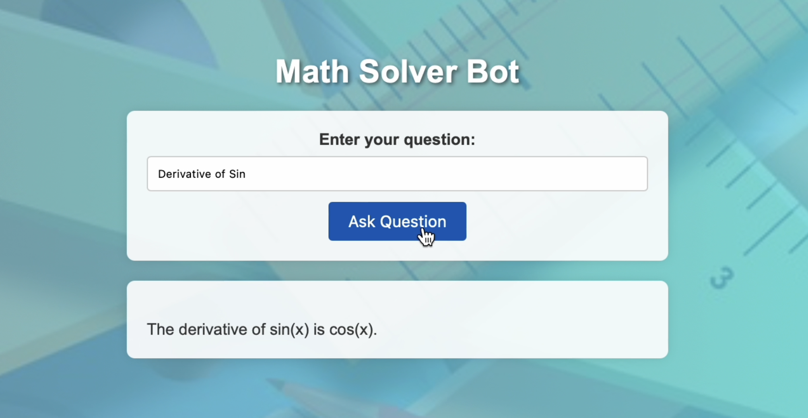
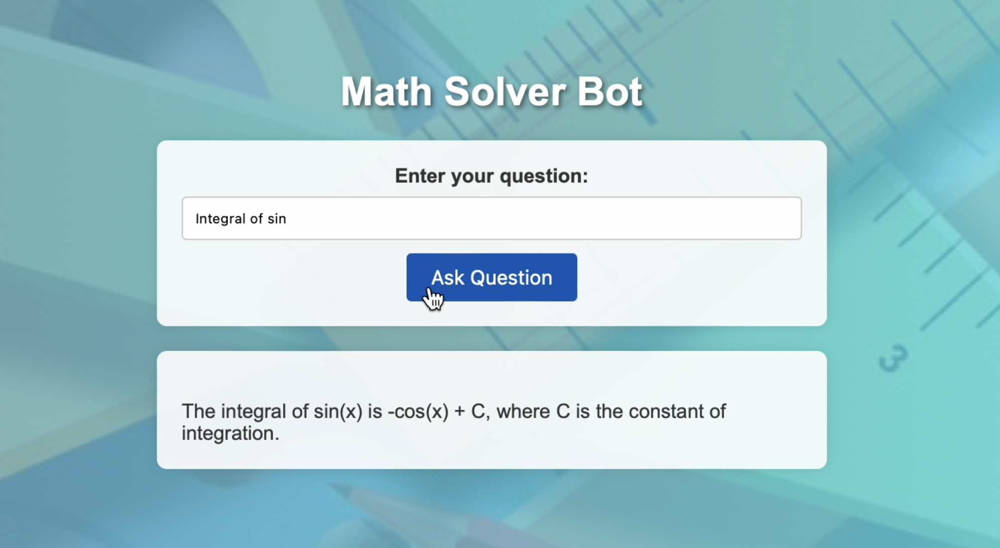

# Math Solver Bot

## Introduction
Math Solver Bot is a Flask web application that leverages the LangChain library to integrate a language model from HuggingFace, a Wikipedia search tool, and a math reasoning tool. It aims to provide solutions for various questions, including mathematical problems and logic-based queries.

## Features
- **Language Model**: Uses HuggingFace's `Mixtral-8x7B-Instruct-v0.1` model to generate responses.
- **Wikipedia Search**: Integrates with Wikipedia to fetch information on general topics.
- **Math Reasoning**: Utilizes LangChain's `LLMMathChain` to solve mathematical problems.
- **Logic-Based Reasoning**: Provides detailed step-by-step solutions for logic-based questions.

## Installation
1. **Clone the repository**:
   ```bash
   git clone https://github.com/umairchanna57/Math-Solver-Bot.git
   cd Math-Solver-Bot


   
<div align="center">
  
</div>

   
<div align="center">
  
</div>


   
<div align="center">
  
</div>


